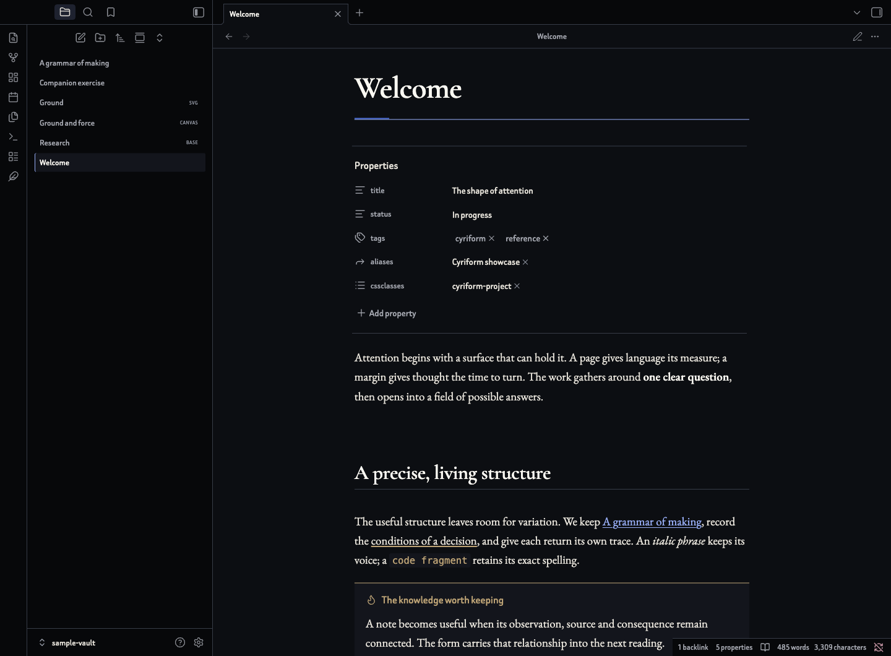
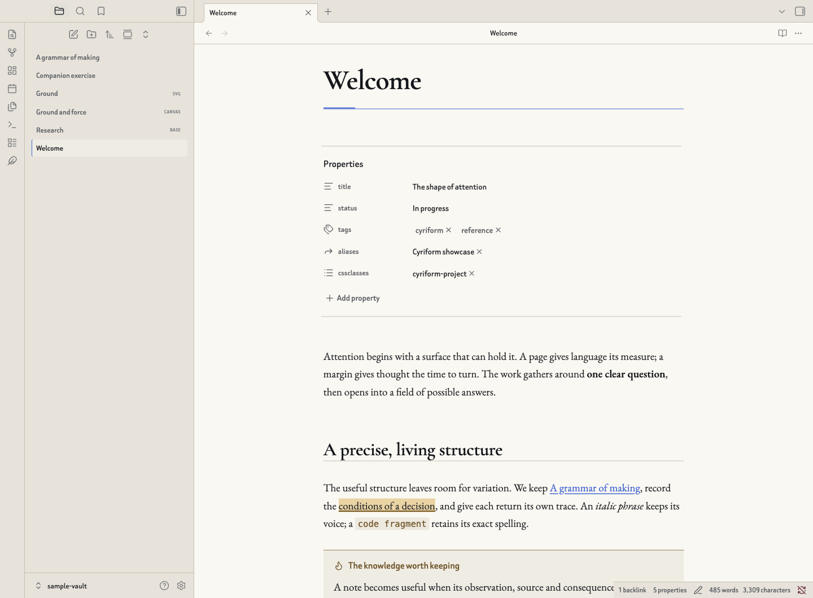

# Cyriform

An editorial theme for Obsidian, built around Ground, Force and Variations. Home black, bone-coloured paper, fine structural rules, directional cobalt, old gold and oxblood give the workspace a deliberate, coherent visual language. Light and dark modes share the same reading-first structure.



## Typography and customisation

Cyriform includes 89 controls through the [Style Settings plugin](https://github.com/mgmeyers/obsidian-style-settings). Reading, heading, interface and code fonts each have their own editable field. The defaults are EB Garamond for reading, Cormorant Garamond for headings, Beiruti for the interface and IBM Plex Mono at the head of a local monospace fallback stack. The first three families are embedded for offline use. Code fonts resolve through IBM Plex Mono, JetBrains Mono, Menlo, Consolas and the platform’s monospace family.

The initial reading size is 19px, with a 1.65 line height and a 70ch measure. Five atmospheres, Home, Clarity, Becoming, Intimacy and Release, retune reading measure, page spacing, interface density, surface warmth, the title force line and transient-layer pace. Colour roles, heading levels, layout, density, callouts, highlights, tags, tables, images, motion and print settings remain independently adjustable. See the complete [settings reference](./SETTINGS.md).



## Features

The theme covers Reading view and Live Preview, six heading levels, properties, callouts, extended tasks, tables, code, mathematics, Mermaid, images, embeds and footnotes. Native Bases, Canvas, graph, navigation, settings, prompts and menus use the shared palette and geometry. Responsive mobile rules, visible keyboard focus, reduced-motion and reduced-transparency preferences, forced-colour fallbacks and white-paper print styles are included.

Scoped compatibility styles cover Calendar, Dataview, Tasks, Kanban, Admonition, Timeline, Editing Toolbar and PDF export interfaces. These integrations follow their public CSS interfaces; plugin-owned behaviour and isolated export pages remain controlled by each plugin.

## Installation

Install from the [official Obsidian Community Directory](https://community.obsidian.md/themes/cyriform) by choosing **Add to Obsidian**. For manual installation, download `manifest.json` and `theme.css` from the latest GitHub Release, place them in `.obsidian/themes/Cyriform` inside your vault, then select **Cyriform** in **Settings → Appearance**. Both files belong in the same folder. The theme requires Obsidian 1.13.0 or later.

Style Settings is optional. The theme includes its own defaults and embedded fonts. Install Style Settings through Obsidian’s community plugin interface to expose its full controls.

## Optional companion

[Cyriform Companion](https://github.com/cyriusweng/cyriform-companion) provides searchable visual pickers for note states, note atmospheres, types, widths, accents, callouts, highlights, task states and image layouts. It includes commands, a ribbon shortcut, an editor context-menu entry and an optional toolbar.

Per-note styles can also be entered directly in the `cssclasses` property:

```yaml
cssclasses:
  - cyriform-important
  - cyriform-atmo-home
  - cyriform-project
  - cyriform-wide
  - cyriform-accent-gold
```

The state choices are `important`, `alert`, `draft`, `archived` and `pinned`; note atmospheres are `atmo-clarity`, `atmo-home`, `atmo-becoming`, `atmo-intimacy` and `atmo-release`; note types are `meeting`, `daily`, `index`, `project`, `question`, `note`, `essay` and `letter`; widths are `narrow`, `wide` and `full-width`. Accent suffixes are `cobalt`, `gold`, `oxblood`, `mineral` and `bone`. Prefix each state, atmosphere, type or width with `cyriform-`, and each accent with `cyriform-accent-`.

Image layout tokens belong in the image description: `cyriform-banner`, `cyriform-left`, `cyriform-right`, `cyriform-grid` and `cyriform-invert`. The [examples](./examples) directory contains a Markdown specimen, a Base, a Canvas and original demonstration artwork.

## Privacy and verification

The theme operates entirely through local CSS and embedded font assets. All features are available free of charge and operate offline. The downloadable CSS contains the font copyright and licence notices.

Native verification used Obsidian 1.13.7 on macOS and covered theme loading, Reading view, Live Preview, four independent Style Settings font changes, Bases and Canvas. Cyriform 1.1.0 passed 39 Chromium assertions across light and dark rendering, all five atmosphere compositions, per-note atmosphere scope, desktop and mobile-width layouts, keyboard focus, reduced motion, default colour contrast and a two-page PDF. Physical iOS and Android devices and complete third-party plugin workflows remain further verification targets. User-selected colours and other snippets can alter measured contrast and layout.

## Development and support

The source and build use Node.js 20 or later with its standard library:

```sh
npm run build
npm test
```

`src/settings.json` owns the settings schema, `src/theme.css` owns the visual system and `src/fonts` contains the bundled font assets. The build produces the root `theme.css`. Report reproducible issues through this repository’s Issues page, including the Obsidian version, operating system, selected settings and a minimal example.

## Licence

Cyriform’s original code, documentation and example artwork are published under the [MIT Licence](./LICENSE), copyright 2026 Cyrius. The embedded EB Garamond, Cormorant Garamond and Beiruti fonts retain their respective SIL Open Font Licence terms and project copyright notices in [licences](./licences). Cyriform is an independently developed community theme for Obsidian.
