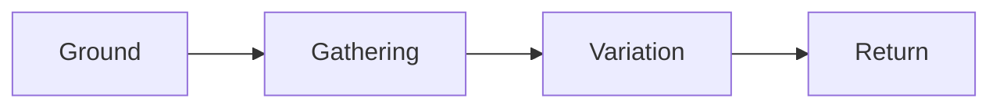

Attention begins with a surface that can hold it. A page gives language its measure; a margin gives thought the time to turn. The work gathers around **one clear question**, then opens into a field of possible answers.

## A precise, living structure

The useful structure leaves room for variation. We keep [[A grammar of making]], record the ==conditions of a decision==, and give each return its own trace. An *italic phrase* keeps its voice; a `code fragment` retains its exact spelling.

> [!important] The knowledge worth keeping
> A note becomes useful when its observation, source and consequence remain connected. The form carries that relationship into the next reading.

## From observation to practice

- [x] Record the first observation
- [/] Test the structure against daily work
- [ ] Return to the source with a better question
- [>] Deferred until the next review
- [<] Scheduled for a quiet morning
- [?] A question worth investigating
- [!] A consequential detail
- [*] An especially useful connection
- ["] A passage to quote
- [-] A cancelled experiment

| Role | Material | Purpose |
| --- | --- | --- |
| Ground | Home black | Continuity and rest |
| Force | Directional cobalt | Action and orientation |
| Memory | Old gold | Knowledge and return |

### A small working definition

```javascript
const attention = {
  ground: 'quiet',
  force: 'deliberate',
  variations: 5
};
```

> Make the relationship visible. Give the next thought a place to begin.

### The shape of a process



The area of a circle follows $A = \pi r^2$.

$$
\int_0^1 x^2\,dx = \frac{1}{3}
$$

---

## Type hierarchy

# Heading one

A leading proposition and its supporting text.

## Heading two

A major section and its supporting text.

### Heading three

A smaller argument and its supporting text.

#### Heading four

A close reading and its supporting text.

##### Heading five

A compact observation and its supporting text.

###### Heading six

A final distinction and its supporting text.

## Semantic annotations

> [!note] A note
> Keep the observation with its context.

> [!tip] A useful practice
> Record the conditions that made this approach useful.

> [!success] A completed check
> The result now has supporting evidence.

> [!warning] A condition to watch
> Revisit this assumption when the source changes.

> [!danger] A consequential risk
> Preserve the original before a destructive operation.

> [!question]- A folded question
> What would change this conclusion?

> [!quote] A quiet margin
> Thought develops through attention and return.

## Lists and links

- A primary observation
  - A supporting detail
    - A precise qualification
- A related observation

1. Gather the evidence.
2. State the relationship.
3. Test the consequence.

Read [[A grammar of making]] and [[A future essay]]. Visit [Obsidian Help](https://help.obsidian.md). The footnote preserves a source association.[^source]

## Images and structured views

![[Ground.svg|A quiet field and a cobalt direction cyriform-banner|800]]

![[Research.base]]

Open [[Ground and force.canvas]] to inspect the spatial workspace.

[^source]: This is original sample content for the Cyriform theme demonstration vault.
